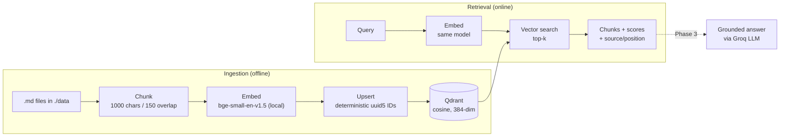

# DocsRAG

A retrieval-augmented generation service for querying document collections with grounded, citable answers — built phase by phase with a production, defend-every-decision mindset rather than as a notebook demo.

The corpus in this repo is a curated set of [FastAPI](https://fastapi.tiangolo.com/) documentation pages, but nothing in the pipeline is tied to it: point it at any collection of markdown files and re-ingest.

> **Status — Phases 0–2 complete.** Ingestion and retrieval work end to end; a grounded-answer endpoint, an eval harness, and app containerization are the next phases. See [Roadmap](#roadmap). This is deliberately a baseline-first build: get a correct, measurable pipeline standing before adding reranking, caching, and guardrails.

---

## What works today

- **Ingestion** — reads `./data/*.md`, chunks per file, embeds locally, and upserts into Qdrant. Re-running is idempotent (no duplicate vectors).
- **Retrieval** — a CLI that embeds a query and returns the top-k chunks with scores and source attribution.
- **API** — FastAPI app with a `/health` liveness probe. The RAG `/ask` endpoint is Phase 3.

Retrieval is sanity-checked against the corpus (e.g. the query _"declare a path parameter"_ returns a top-5 drawn entirely from the `path-params*` docs). A proper eval harness replaces spot-checks in Phase 4.

## Architecture



The same embedding model is used on both sides — a hard requirement, since matching vector _dimensions_ does not mean matching vector _spaces_. Generation (dashed) is the next phase.

## Design decisions

The choices worth defending, straight from the build:

| Decision              | Choice                                                    | Why                                                                                                                                                                                                                                                         |
| --------------------- | --------------------------------------------------------- | ----------------------------------------------------------------------------------------------------------------------------------------------------------------------------------------------------------------------------------------------------------- |
| Chunking              | Fixed-size, 1000 chars, 150 overlap, per file             | A deliberate baseline, not a tuned value — measure with evals before moving to structure-aware chunking. Overlap insures against ideas cut mid-boundary. Per-file (not over a concatenated blob) so every chunk traces to exactly one source for citations. |
| Embeddings            | `bge-small-en-v1.5` via fastembed, run locally            | Local-first: no per-call API cost, no data leaving the box, low latency. 384-dim.                                                                                                                                                                           |
| Same model both sides | Enforced                                                  | Dimension mismatch fails loud (upsert rejected); space mismatch fails _silent_ (retrieval returns garbage). The silent failure is the dangerous one.                                                                                                        |
| Distance metric       | Cosine                                                    | Meaning lives in direction, not magnitude — a longer chunk shouldn't rank higher just for being longer. bge vectors are normalized, so cosine collapses to the dot product.                                                                                 |
| Vector store          | Qdrant (Dockerized)                                       | Stores chunk text + source + position as payload, so citations fall out of retrieval for free. Runs locally via a pinned official image.                                                                                                                    |
| LLM access            | `openai` SDK pointed at Groq's OpenAI-compatible endpoint | Provider-agnostic adapter: swapping providers is a `base_url` + key change in `.env`, read from one shared settings object. No provider-specific code in the domain.                                                                                        |
| Config                | pydantic-settings, fail-fast at startup                   | A missing/malformed key throws at process start, before accepting connections — turning a production incident into a failed deployment the orchestrator can roll back.                                                                                      |
| Re-ingestion          | Deterministic `uuid5` IDs + upsert                        | Same content → same ID → upsert overwrites in place. Re-running ingestion keeps the point count stable instead of duplicating.                                                                                                                              |
| Project layout        | `src/` package layout                                     | Forces importing the package by name, the way installed code must — catches the "works locally, missing after install" class of packaging bug.                                                                                                              |
| Containerization      | Qdrant in Docker, app native (dev)                        | Containerize the dependency you set once and isolate; keep the app you're actively changing native with `--reload` for a fast loop. App gets a Dockerfile at Phase 5 for prod.                                                                              |

More detail lives in [`Notes/`](./Notes) — study notes on RAG concepts, architecture decisions, and Python mechanics.

## Tech stack

- **Language / tooling** — Python 3.12, [uv](https://github.com/astral-sh/uv)
- **API** — FastAPI, uvicorn (ASGI)
- **Vector DB** — Qdrant
- **Embeddings** — fastembed (`BAAI/bge-small-en-v1.5`, local)
- **LLM** — Groq via the OpenAI-compatible API (`llama-3.3-70b-versatile`, fallback `llama-3.1-8b-instant`)
- **Config / validation** — pydantic, pydantic-settings
- **Reliability / tests** — tenacity, pytest

## Getting started

### Prerequisites

- Python 3.12 (uv can install it)
- Docker (for Qdrant)
- A Groq API key

### Setup

```bash
git clone https://github.com/Mandark31/DocsRAG.git
cd DocsRAG

# environment
cp .env.example .env        # add your GROQ_API_KEY

# dependencies (uv creates the venv and installs from uv.lock)
uv sync

# start Qdrant (persists to a named volume)
docker compose up -d
```

### Ingest and query

```bash
# embed ./data/*.md and upsert into Qdrant
uv run python -m docsrag.ingest

# retrieve the top matches for a query
uv run python -m docsrag.search "declare a path parameter"

# run the API (health check only for now)
uv run uvicorn docsrag.api:app --reload --app-dir src
# -> GET http://localhost:8000/health  ->  {"status": "ok"}
```

Qdrant's dashboard is at `http://localhost:6333/dashboard` — useful for confirming the collection size (384), metric (cosine), and point count after ingestion.

## Project structure

```
DocsRAG/
├── src/docsrag/
│   ├── api.py           # FastAPI app (/health; /ask in Phase 3)
│   ├── config.py        # typed, fail-fast settings (pydantic-settings)
│   ├── models.py        # Chunk DTO (id, text, source, position)
│   ├── embeddings.py    # fastembed model, cached as a per-process singleton
│   ├── vectorstore.py   # Qdrant collection, upsert, search
│   ├── ingest.py        # load -> chunk -> embed -> upsert
│   └── search.py        # retrieval CLI
├── scripts/smoke_groq.py  # Phase 0 LLM connectivity check
├── data/                # corpus (FastAPI docs .md)
├── Notes/               # design + concept study notes
├── docker-compose.yml   # Qdrant
├── pyproject.toml
└── uv.lock
```

## Roadmap

- [x] **Phase 0** — Scaffold: uv, Dockerized Qdrant, fail-fast typed config, FastAPI `/health`, Groq smoke test
- [x] **Phase 1** — Ingestion: per-file chunking, local bge-small embeddings, Qdrant upsert with deterministic IDs
- [x] **Phase 2** — Retrieval: top-k vector search with source attribution (CLI)
- [ ] **Phase 3** — Streaming `/ask` endpoint: grounded answers with inline citations via Groq
- [ ] **Phase 4** — Eval harness: LLM-as-judge for retrieval hit-rate and answer faithfulness, replacing manual spot-checks
- [ ] **Phase 5** — App Dockerfile + Compose service for a reproducible, fully containerized deployment
- [ ] **Later** — Structure-aware chunking, reranking, semantic caching, input/output guardrails, request tracing and metrics

## License

MIT
