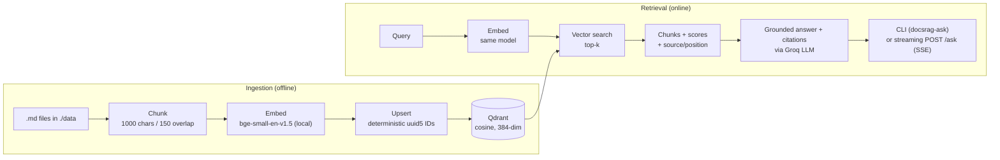

# DocsRAG

A retrieval-augmented generation service for querying document collections with grounded, citable answers — built phase by phase with a production, defend-every-decision mindset rather than as a notebook demo.

The corpus in this repo is a curated set of [FastAPI](https://fastapi.tiangolo.com/) documentation pages, but nothing in the pipeline is tied to it: point it at any collection of markdown files and re-ingest.

> **Status — Phases 0–5 complete.** The full RAG pipeline works end to end: ingestion, retrieval, grounded generation with inline citations, a streaming `/ask` API, an LLM-judge eval harness, and a fully containerized app + Qdrant via Docker Compose. Remaining work is retrieval-quality upgrades (reranking, hybrid search) and other refinements. See [Roadmap](#roadmap). This was deliberately a baseline-first build: get a correct, measurable pipeline standing before adding reranking, caching, and guardrails.

---

## What works today

- **Ingestion** — reads `./data/*.md`, strips doc-build macros, chunks per file, embeds locally, and upserts into Qdrant. Re-ingestion is an idempotent full rebuild (no orphaned or duplicate vectors).
- **Retrieval** — embeds a query and returns the top-k chunks with scores and source attribution.
- **Generation** — grounded answers with **inline numbered citations** (`[1]`, `[2]`…) and a Sources list; the model is instructed to decline rather than hallucinate when the corpus lacks the answer.
- **API** — FastAPI app with a `/health` probe and a **streaming `POST /ask`** endpoint (Server-Sent Events: a `sources` event, then token-by-token, then `done`).
- **Eval** — an LLM-judge harness grades a golden Q&A set for semantic correctness and asserts an accuracy threshold (currently 11/12 = 92%).
- **Deployment** — the app is containerized; `docker compose up --build` brings up the API and Qdrant together.

## Architecture



The same embedding model is used on both sides — a hard requirement, since matching vector _dimensions_ does not mean matching vector _spaces_. Retrieved chunks are numbered in the prompt so the model can cite them inline (`[n]`), and their order is preserved for a deterministic Sources footer.

## Design decisions

The choices worth defending, straight from the build:

| Decision              | Choice                                                    | Why                                                                                                                                                                                                                                                         |
| --------------------- | --------------------------------------------------------- | ----------------------------------------------------------------------------------------------------------------------------------------------------------------------------------------------------------------------------------------------------------- |
| Chunking              | Fixed-size, 1000 chars, 150 overlap, per file             | A deliberate baseline, not a tuned value — measure with evals before moving to structure-aware chunking. Overlap insures against ideas cut mid-boundary. Per-file (not over a concatenated blob) so every chunk traces to exactly one source for citations. |
| Embeddings            | `bge-small-en-v1.5` via fastembed, run locally            | Local-first: no per-call API cost, no data leaving the box, low latency. 384-dim.                                                                                                                                                                           |
| Same model both sides | Enforced                                                  | Dimension mismatch fails loud (upsert rejected); space mismatch fails _silent_ (retrieval returns garbage). The silent failure is the dangerous one.                                                                                                        |
| Distance metric       | Cosine                                                    | Meaning lives in direction, not magnitude — a longer chunk shouldn't rank higher just for being longer. bge vectors are normalized, so cosine collapses to the dot product.                                                                                 |
| Vector store          | Qdrant (Dockerized)                                       | Stores chunk text + source + position as payload, so citations fall out of retrieval for free. Runs locally via a pinned official image.                                                                                                                    |
| LLM access            | `openai` SDK pointed at Groq's OpenAI-compatible endpoint | Provider-agnostic adapter: swapping providers is a `base_url` + key change in `.env`, read from one shared settings object. No provider-specific code in the domain.                                                                                        |
| Config                | pydantic-settings, fail-fast at startup                   | A missing/malformed key throws at process start, before accepting connections — turning a production incident into a failed deployment the orchestrator can roll back.                                                                                      |
| Re-ingestion          | Deterministic `uuid5` IDs + upsert                        | Same content → same ID → upsert overwrites in place. Re-running ingestion keeps the point count stable instead of duplicating.                                                                                                                              |
| Project layout        | `src/` package layout                                     | Forces importing the package by name, the way installed code must — catches the "works locally, missing after install" class of packaging bug.                                                                                                              |
| Citations             | Numbered context `[n]` → Sources footer                   | Chunk position in the prompt is the citation index; returning chunks in that order makes attribution deterministic with no parsing of model output.                                                                                                         |
| Eval                  | LLM-judge + accuracy threshold (pytest)                   | Generation isn't reproducible, so semantic grading beats string matching. The judge prompt must state the pass criterion explicitly or it over-fails correct paraphrases. A threshold (≥0.9) catches regressions without brittle per-case asserts.          |
| LLM resilience        | tenacity retries (backoff) on transient errors            | Rate-limits / connection blips retry with exponential backoff (3 attempts); non-transient errors fail fast. All calls route through one retried `chat()` helper.                                                                                            |
| Markdown cleaning     | Strip doc-build macros at ingest                          | FastAPI docs embed `{* ... *}` include macros — noise for retrieval. Cleaning the data once is more robust than hoping the model ignores it.                                                                                                                |
| Containerization      | App + Qdrant via Docker Compose                           | Containerize the dependency you set once (Qdrant) and the app itself, so `docker compose up --build` is a one-command bring-up. In dev you can still run the app native with `--reload` for a fast loop.                                                    |

More detail lives in [`Notes/`](./Notes) — study notes on RAG concepts, architecture decisions, and Python mechanics.

## Tech stack

- **Language / tooling** — Python 3.12, [uv](https://github.com/astral-sh/uv)
- **API** — FastAPI, uvicorn (ASGI)
- **Vector DB** — Qdrant
- **Embeddings** — fastembed (`BAAI/bge-small-en-v1.5`, local)
- **LLM** — Groq via the OpenAI-compatible API (`llama-3.3-70b-versatile`, fallback `llama-3.1-8b-instant`)
- **Config / validation** — pydantic, pydantic-settings
- **Reliability / tests** — tenacity, pytest

## Getting started

### Prerequisites

- Python 3.12 (uv can install it)
- Docker (for Qdrant)
- A Groq API key

### Setup

```bash
git clone https://github.com/Mandark31/DocsRAG.git
cd DocsRAG

# environment
cp .env.example .env        # add your LLM_API_KEY

# dependencies (uv creates the venv and installs from uv.lock)
uv sync

# start Qdrant (persists to a named volume)
docker compose up -d
```

### Ingest and query

```bash
# embed ./data/*.md and upsert into Qdrant
uv run docsrag-ingest

# retrieve the top matches for a query
uv run docsrag-search "declare a path parameter"

# ask a question and get a cited answer in the console
uv run docsrag-ask "how do I return an HTTP error?"

# run the API (health + streaming /ask)
uv run uvicorn docsrag.api:app --reload --app-dir src

# stream an answer over SSE:
curl -N -X POST localhost:8000/ask \
  -H 'content-type: application/json' \
  -d '{"question":"declare a path parameter"}'

# run the eval harness
uv run pytest eval/ -v -s
```

Qdrant's dashboard is at `http://localhost:6333/dashboard` — useful for confirming the collection size (384), metric (cosine), and point count after ingestion. Interactive API docs are at `http://localhost:8000/docs`.

### Run everything in Docker

```bash
cp .env.example .env          # add your LLM_API_KEY
docker compose up --build     # starts the app (:8000) and Qdrant together
docker compose run --rm app docsrag-ingest   # ingest into the containerized Qdrant
```

## Project structure

```
DocsRAG/
├── src/docsrag/
│   ├── api.py           # FastAPI app (/health, streaming POST /ask)
│   ├── config.py        # typed, fail-fast settings (pydantic-settings)
│   ├── models.py        # Chunk + AskRequest DTOs
│   ├── embeddings.py    # fastembed model, cached as a per-process singleton
│   ├── vectorstore.py   # Qdrant collection, upsert, search
│   ├── ingest.py        # clean -> chunk -> embed -> upsert
│   ├── retrieval.py     # retrieve(query, k) -> list[Chunk]
│   ├── llm.py           # OpenAI-compatible client + retried chat()
│   ├── generate.py      # prompt-building, citations, blocking + streaming
│   ├── search.py        # retrieval CLI
│   └── ask.py           # cited-answer CLI
├── eval/
│   ├── golden_qa.json   # 12 reference Q&A pairs
│   └── test_eval.py     # LLM-judge harness + accuracy threshold
├── scripts/smoke_groq.py  # Phase 0 LLM connectivity check
├── data/                # corpus (FastAPI docs .md)
├── Notes/               # design + concept study notes
├── Dockerfile           # app image
├── docker-compose.yml   # app + Qdrant
├── pyproject.toml
└── uv.lock
```

## Roadmap

- [x] **Phase 0** — Scaffold: uv, Dockerized Qdrant, fail-fast typed config, FastAPI `/health`, Groq smoke test
- [x] **Phase 1** — Ingestion: per-file chunking, local bge-small embeddings, Qdrant upsert with deterministic IDs
- [x] **Phase 2** — Retrieval: top-k vector search with source attribution (CLI)
- [x] **Phase 3** — Streaming `/ask` endpoint: grounded answers with inline citations via Groq (SSE)
- [x] **Phase 4** — Eval harness: LLM-as-judge for answer correctness with an accuracy threshold
- [x] **Phase 5** — Polish + deployment: LLM retries, ingest cleaning, console-script entry points, packaged install, app Dockerfile + Compose service, docs
- [ ] **Later** — Structure-aware chunking, reranking / hybrid search (one eval miss traces to a recall gap on rephrased queries), retries on the vector store, semantic caching, input/output guardrails, request tracing and metrics

## License

MIT
